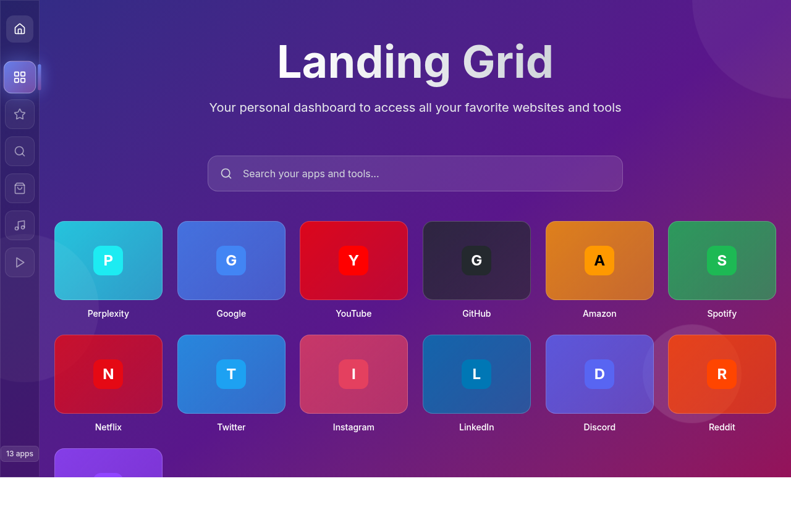

# Landing Grid

A fast, responsive personal start page / link dashboard built with
[Zola](https://www.getzola.org/) and Tailwind CSS v4. Your links are defined in
one TOML file and rendered as a searchable, filterable grid of glassmorphic
tiles — no runtime CDNs, no third‑party requests.



## Features

- **Data‑driven** — add or edit links in `data/links.toml`; no template edits needed.
- **Search & category filters** — instant client‑side search and sidebar filters.
- **Self‑contained** — self‑hosted fonts (Inter, JetBrains Mono) and inline SVG
  icons; nothing loads from a CDN at runtime.
- **Accessible** — keyboard support, ARIA labels, visible focus, reduced‑motion
  support, and AA‑contrast checks enforced in CI.
- **Secure by default** — a strict Content‑Security‑Policy, build‑time validation
  of link data, and a hardened container image.
- **Fully gated** — one command (`make ci`) runs build, accessibility, behavior,
  performance, and supply‑chain checks; CI adds an end‑to‑end container test.

## Requirements

- [Zola](https://www.getzola.org/documentation/getting-started/installation/) 0.19+
- Node.js 22+

A pinned toolchain is provided via [devbox](https://www.jetify.com/devbox)
(`devbox shell`).

## Quick start

```bash
git clone <your-repo-url> landing-grid
cd landing-grid

npm ci            # install the build/test toolchain
npm run dev       # Tailwind watch + zola serve → http://localhost:1111
```

Production build:

```bash
npm run build     # compiles CSS, then `zola build` into ./public
```

## Configuration

### Site — `config.toml`

```toml
base_url = "https://your-domain.example"
title = "Modern Landing Grid"
description = "Your personal dashboard"
theme = "landing-grid"
minify_html = true

[extra]
favicon = "favicon.svg"
open_links_in_new_window = true

# Sidebar category. `tag` must match a tile tag; `icon` is one of the built-ins.
[[extra.nav]]
name = "favorites"
tag  = "favorite"
icon = "star"
```

Built‑in icons: `home`, `grid` (aka `th`), `star`, `search`, `shopping-bag`,
`music`, `play`. Add more in `themes/landing-grid/templates/partials/icons.html`.

### Links — `data/links.toml`

```toml
[[tiles]]
name      = "Perplexity"          # label + accessible name (required)
url       = "https://perplexity.ai"  # http(s) or root-relative (required)
bg_color  = "#1debf2"             # optional, #RRGGBB
txt_color = "#FFFFFF"             # optional, #RRGGBB
tags      = ["favorite", "search"]   # optional category tokens
```

Link data is checked by the `make links` gate (also run in CI and the
pre‑commit hook): URLs must be `http(s)` or root‑relative and colors 6‑digit
hex — an invalid tile fails that check.

## Customization

Styling uses **Tailwind v4** (CSS‑first — there is no `tailwind.config.js`).
Edit the design tokens in the `@theme` block of `src/input.css`:

```css
@theme {
  --color-brand-primary: #667eea;
  --color-brand-secondary: #764ba2;
  --font-inter: "Inter", sans-serif;
}
```

## Project structure

```
.
├── config.toml                 # Site config (base_url, nav, minify_html)
├── content/_index.md           # Home section
├── data/links.toml             # Tile data (validated at build)
├── src/input.css               # Tailwind v4 source (@theme, @plugin, components)
├── package.json                # Build + test toolchain
├── Makefile                    # Single entrypoint for every check (make ci)
├── Dockerfile · nginx/         # Hardened container build + server config
├── scripts/                    # Build-time validators & CI helpers
└── themes/landing-grid/
    ├── theme.toml
    ├── templates/              # base, index, page, section, 404, partials/icons
    └── static/                 # compiled css, js/app.js, self-hosted fonts
```

The build tooling lives at the repository root; the reusable Zola theme is under
`themes/landing-grid/`.

## Quality gates

`make ci` runs the checks locally (see `make help`); each is also a CI job
required to merge. The container image build and served‑page smoke test run in
CI only — `make ci` lints the Dockerfile with `hadolint`.

| Area | Check | `make ci` | CI |
| --- | --- | :---: | :---: |
| Build | Tailwind v4 compile + `zola build`, `zola check` | ✓ | ✓ |
| Markup | `html-validate` | ✓ | ✓ |
| Accessibility | `pa11y` (WCAG 2 AA) + axe in Playwright | ✓ | ✓ |
| Behavior | Playwright end‑to‑end tests | ✓ | ✓ |
| Performance / SEO | Lighthouse budgets | ✓ | ✓ |
| Data | `data/links.toml` validator | ✓ | ✓ |
| Container | `hadolint` (+ image build & smoke test in CI) | lint only | ✓ |
| Supply chain | `actionlint` (runs `shellcheck` on workflows) + `gitleaks` | ✓ | ✓ |
| Regression | per‑item invariants + a coverage check | ✓ | ✓ |

Lighthouse budgets enforced in CI: performance ≥ 90, accessibility ≥ 95,
best‑practices ≥ 90, SEO = 100.

Enable the local pre‑commit gate once per clone:

```bash
git config core.hooksPath .githooks
```

## Deployment

### GitHub Pages

Pushing to `main` runs `.github/workflows/main.yml`, which builds the site and
publishes it to the `gh-pages` branch. In **Settings → Pages**, set the source to
**Deploy from a branch → `gh-pages`**. For a custom domain, edit `static/CNAME`.

To require the checks before merging, protect `main` and mark the
**All gates green** status check as required — see
[`docs/branch-protection.md`](docs/branch-protection.md).

### Docker

```bash
docker compose up --build     # serves the hardened nginx image on 127.0.0.1:8090
```

The image is multi‑stage (build → static nginx), runs read‑only with dropped
capabilities, and sets a CSP and security headers.

## Tech stack

Zola · Tailwind CSS v4 · vanilla JavaScript · nginx · Docker.

## License

MIT © Anibal Aguila
