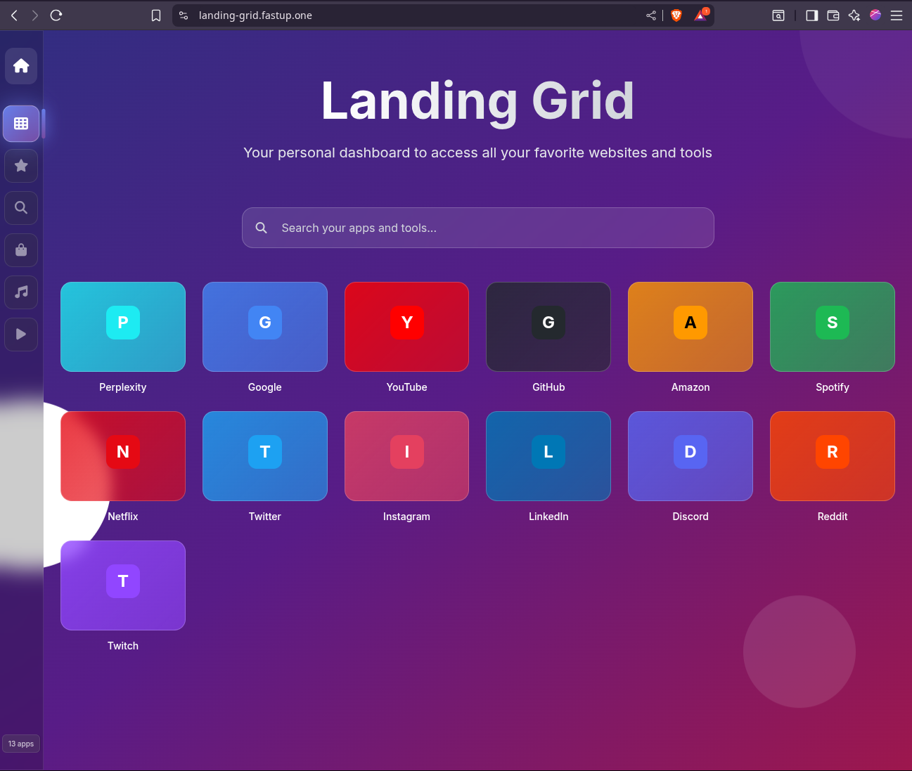

# 🚀 Landing Grid - Zola Theme

> **Migrated from Hugo Slate Theme** - A complete migration and modernization of the popular Hugo Slate theme to Zola with enhanced features and modern design.

A professional, responsive landing grid theme for Zola static site generator. Perfect for creating beautiful dashboards, app launchers, and link directories with a modern glassmorphism design.



## 🔄 **Migration from Hugo Slate**

This theme is a **complete migration** from the Hugo Slate theme to Zola, featuring:

### **What Was Preserved**
- ✅ Core speed dial functionality
- ✅ Tile-based navigation system
- ✅ Category filtering capabilities
- ✅ Search functionality
- ✅ Responsive grid layout
- ✅ Link management system

### **What Was Enhanced**
- 🆕 **Modern Glassmorphism Design** - Backdrop blur effects and glass panels
- 🆕 **Professional Navigation** - Clean sidebar with smooth animations
- 🆕 **Tailwind CSS Integration** - Modern utility-first CSS framework
- 🆕 **Enhanced Animations** - Smooth fade transitions and hover effects
- 🆕 **Better Responsiveness** - Optimized for all screen sizes
- 🆕 **Keyboard Shortcuts** - ESC to clear, number keys for navigation
- 🆕 **URL Hash Support** - Shareable filtered views
- 🆕 **Production Build System** - Optimized CSS compilation

## ✨ Features

### 🎨 **Modern Design**
- **Glassmorphism Effects**: Beautiful backdrop blur and transparency
- **Gradient Backgrounds**: Stunning color gradients (indigo → purple → pink)
- **Professional Navigation**: Clean sidebar with icon-based filtering
- **Smooth Animations**: Fade transitions, hover effects, and loading animations
- **Typography**: Inter font for modern, clean readability

### 📱 **Fully Responsive Grid System**
- **Mobile (< 640px)**: 2 columns
- **Small Tablets (640px+)**: 3 columns  
- **Tablets (768px+)**: 4 columns
- **Desktop (1024px+)**: 5 columns
- **Large Screens (1280px+)**: 6 columns
- **Ultra-wide**: Optimized spacing and layout

### ⚡ **Interactive Features**
- **Real-time Search**: Instant filtering as you type
- **Category Filtering**: Click navigation icons to filter by category
- **Smooth Transitions**: Tiles fade in/out with staggered animations
- **Keyboard Shortcuts**:
  - `ESC` - Clear search and show all tiles
  - `1-9` - Quick navigation to filter categories
- **URL Hash Support**: Shareable links like `#favorites` or `#tools`
- **Visual Feedback**: Hover effects, active states, and app counters

### 🛠 **Technical Excellence**
- **Zola Static Site Generator**: Fast, secure, and SEO-optimized
- **Tailwind CSS**: Utility-first CSS framework for consistency
- **CDN Integration**: Fast loading with cloud-delivered assets
- **Production Ready**: Minified CSS and optimized assets
- **Accessibility**: Proper ARIA labels and keyboard navigation
- **Modern Browser Support**: Chrome, Firefox, Safari, Edge

## 🚀 Quick Start

### 1. Clone or Download Theme

```bash
# Clone into your Zola site's themes directory
cd your-zola-site/themes
git clone https://github.com/fastup-one/landing-grid-zola landing-grid

# Or download and extract
curl -L https://github.com/fastup-one/landing-grid-zola/archive/main.zip -o landing-grid.zip
unzip landing-grid.zip && mv landing-grid-zola-main landing-grid
```

### 2. Configure Your Site

Update your `config.toml`:

```toml
base_url = "https://yourdomain.com"
title = "My Landing Dashboard"
description = "Your personal dashboard for quick access to favorite tools and websites"
theme = "landing-grid"

[extra]
favicon = "favicon.ico"
open_links_in_new_window = true

# Navigation categories (customize icons and names)
[[extra.nav]]
name = "favorites"
tag = "favorite"
icon = "star"

[[extra.nav]]
name = "tools"
tag = "tools" 
icon = "wrench"

[[extra.nav]]
name = "social"
tag = "social"
icon = "users"

[[extra.nav]]
name = "work"
tag = "work"
icon = "briefcase"

[[extra.nav]]
name = "entertainment"
tag = "entertainment"
icon = "play"
```

### 3. Add Your Tiles

Create `data/links.toml` with your favorite sites:

```toml
[[tiles]]
name = "GitHub"
url = "https://github.com"
bg_color = "#24292E"
txt_color = "#FFFFFF"
tags = ["tools", "favorite", "work"]

[[tiles]]
name = "Gmail" 
url = "https://gmail.com"
bg_color = "#EA4335"
txt_color = "#FFFFFF"
tags = ["tools", "work"]

[[tiles]]
name = "YouTube"
url = "https://youtube.com"
bg_color = "#FF0000"
txt_color = "#FFFFFF"
tags = ["entertainment", "favorite"]

[[tiles]]
name = "Spotify"
url = "https://spotify.com"
bg_color = "#1DB954"
txt_color = "#FFFFFF"
tags = ["entertainment"]

[[tiles]]
name = "Twitter"
url = "https://twitter.com"
bg_color = "#1DA1F2"  
txt_color = "#FFFFFF"
tags = ["social"]

[[tiles]]
name = "LinkedIn"
url = "https://linkedin.com"
bg_color = "#0077B5"
txt_color = "#FFFFFF"
tags = ["social", "work"]
```

### 4. Build & Serve

```bash
# Development server
zola serve

# Production build
zola build

# Your site will be in the 'public/' directory
```

## ⚙️ Configuration Options

### Navigation Categories

Each navigation item supports:

```toml
[[extra.nav]]
name = "category-name"    # Display name in tooltips
tag = "filter-tag"       # Tag to filter tiles
icon = "font-awesome-icon" # FontAwesome icon name (without 'fa-')
```

**Available FontAwesome Icons**: `star`, `heart`, `wrench`, `briefcase`, `users`, `play`, `music`, `shopping-bag`, `search`, `home`, `cog`, `book`, `camera`, `gamepad`

### Tile Properties

Each tile supports:

```toml
[[tiles]]
name = "Site Name"           # Required - Display name
url = "https://example.com"  # Required - Target URL  
bg_color = "#FF6B6B"        # Optional - Hex background color
txt_color = "#FFFFFF"       # Optional - Hex text color
tags = ["tag1", "tag2"]     # Optional - Categories for filtering
```

### Global Settings

```toml
[extra]
favicon = "favicon.ico"              # Site favicon
open_links_in_new_window = true      # Open tiles in new tab/window
```

## 🎨 Customization

### Color Themes

The theme uses CSS custom properties for easy customization. Create a custom CSS file:

```css
:root {
  /* Background gradient colors */
  --gradient-start: #667eea;    /* Indigo */
  --gradient-middle: #764ba2;   /* Purple */ 
  --gradient-end: #f093fb;      /* Pink */
  
  /* Glass effects */
  --glass-bg: rgba(255, 255, 255, 0.1);
  --glass-border: rgba(255, 255, 255, 0.2);
  --glass-dark: rgba(0, 0, 0, 0.2);
}

/* Custom gradient example */
body {
  background: linear-gradient(135deg, var(--gradient-start), var(--gradient-middle), var(--gradient-end));
}
```

### Layout Customization

Modify grid columns in `templates/index.html`:

```html
<!-- Default: 2-6 responsive columns -->
<div class="grid grid-cols-2 sm:grid-cols-3 md:grid-cols-4 lg:grid-cols-5 xl:grid-cols-6 gap-6">

<!-- Fixed 4 columns example -->
<div class="grid grid-cols-4 gap-6">

<!-- Large tiles example -->  
<div class="grid grid-cols-1 sm:grid-cols-2 md:grid-cols-3 gap-8">
```

## 🔧 Development

### Prerequisites
- **Zola** v0.17.0+ ([Install Zola](https://getzola.org/documentation/getting-started/installation/))
- **Node.js** 16+ (for CSS building)
- **Git** (for version control)

### Development Setup

```bash
# Clone the theme
git clone https://github.com/fastup-one/landing-grid-zola
cd landing-grid-zola

# Install dependencies
npm install

# Start development with CSS watching
npm run dev
```

### Build Commands

```bash
npm run build-css        # Build CSS with watching
npm run build-css-prod   # Build minified production CSS  
npm run dev             # Start Zola dev server + CSS watching
npm run build           # Full production build
npm run clean           # Clean generated files
```

### File Structure

```
themes/landing-grid/
├── templates/
│   ├── base.html           # Main template with navigation
│   ├── index.html          # Grid layout and tile rendering
│   └── partials/           # Reusable template components
├── static/
│   ├── css/
│   │   └── tailwind.css    # Generated/compiled CSS
│   └── js/                 # Theme JavaScript (if needed)
├── src/
│   └── input.css          # Source Tailwind CSS
├── theme.toml             # Theme metadata
├── tailwind.config.js     # Tailwind configuration
├── package.json           # Build tools and dependencies
└── README.md              # This documentation
```

## 🚀 Deployment

### Static Hosting Platforms

Deploy to any static hosting service:

**Netlify**:
```bash
# Build command: zola build
# Publish directory: public
```

**Vercel**:
```bash  
# Build command: zola build
# Output directory: public
```

**GitHub Pages**:
```yaml
# .github/workflows/deploy.yml
name: Deploy to GitHub Pages

on:
  push:
    branches: [ main ]

jobs:
  build:
    runs-on: ubuntu-latest
    steps:
      - name: Checkout
        uses: actions/checkout@v3
        
      - name: Setup Zola
        uses: taiki-e/install-action@zola
        
      - name: Build site
        run: zola build
        
      - name: Deploy to GitHub Pages
        uses: peaceiris/actions-gh-pages@v3
        with:
          github_token: ${{ secrets.GITHUB_TOKEN }}
          publish_dir: ./public
```

**Cloudflare Pages**:
- Build command: `zola build`
- Build output directory: `public`

## 🎯 Use Cases

### 📊 **Personal Dashboard**
Perfect for creating your daily-use homepage with:
- Frequently visited websites
- Work tools and applications  
- Social media shortcuts
- Entertainment platforms

### 🏢 **Team/Company Resources**
Great for organizational tool directories:
- Internal applications and tools
- Documentation and wikis
- Project management systems
- Communication platforms

### 🎨 **Portfolio Showcase**
Ideal for creative professionals:
- Project galleries and demos
- Social media profiles
- Client resources
- Creative tools and inspiration

### 📚 **Resource Collections**
Perfect for curated link collections:
- Learning resources and tutorials
- Industry tools and software
- Reference materials
- Community and forums

## 📊 **Migration Comparison**

| Feature | Hugo Slate | Landing Grid (Zola) |
|---------|------------|---------------------|
| **Static Site Generator** | Hugo | Zola |
| **CSS Framework** | Custom SCSS | Tailwind CSS |
| **Design Style** | Basic/Minimal | Modern Glassmorphism |
| **Navigation** | Basic list | Professional sidebar |
| **Animations** | Limited | Smooth transitions |
| **Responsive Design** | Basic | Fully optimized |
| **Search** | Basic | Real-time with transitions |
| **Keyboard Shortcuts** | None | ESC, Number keys |
| **URL Hash Support** | Basic | Full support |
| **Build System** | Hugo pipes | Tailwind + Zola |
| **Documentation** | Minimal | Comprehensive |

## 🤝 Contributing

We welcome contributions! Here's how you can help:

1. **Fork** the repository
2. **Create** a feature branch (`git checkout -b feature/amazing-feature`)
3. **Commit** your changes (`git commit -m 'Add amazing feature'`)  
4. **Push** to the branch (`git push origin feature/amazing-feature`)
5. **Open** a Pull Request

### Types of Contributions
- 🐛 **Bug fixes** - Fix issues or improve functionality
- ✨ **New features** - Add new capabilities or options
- 📝 **Documentation** - Improve guides, examples, or README
- 🎨 **Design** - Enhance UI/UX or add themes
- ⚡ **Performance** - Optimize loading or rendering

## 📄 License

This project is licensed under the **MIT License** - see the [LICENSE](LICENSE) file for details.

### Hugo Slate Attribution
Originally inspired by and migrated from the Hugo Slate theme. This Zola version is a complete rewrite with significant enhancements and modern features.

## 🙏 Acknowledgments

- **Hugo Slate Theme** - Original inspiration and concept
- **[Zola](https://getzola.org/)** - Fast and flexible static site generator  
- **[Tailwind CSS](https://tailwindcss.com/)** - Utility-first CSS framework
- **[Font Awesome](https://fontawesome.com/)** - Beautiful icons
- **[Inter Font](https://rsms.me/inter/)** - Modern typography
- **[Glassmorphism](https://glassmorphism.com/)** - Design inspiration

## 📞 Support & Community

### Get Help
- 📖 **[Documentation](https://github.com/fastup-one/landing-grid-zola/wiki)** - Comprehensive guides
- 🐛 **[Issue Tracker](https://github.com/fastup-one/landing-grid-zola/issues)** - Bug reports and feature requests  
- 💬 **[Discussions](https://github.com/fastup-one/landing-grid-zola/discussions)** - Community support

### Stay Updated
- ⭐ **Star this repo** to get notified of updates
- 👀 **Watch releases** for new versions
- 🐦 **Follow on Twitter** [@fastup-one] for announcements

## 🐳 Docker Deployment

The Landing Grid theme comes with full Docker support for easy deployment and development.

### 🚀 **Quick Deployment**

Deploy with a single command:

```bash
# Production deployment on port 80
docker-compose up -d landing-grid

# Or build and run directly
docker build -t landing-grid-zola .
docker run -d -p 80:80 --name landing-grid landing-grid-zola
```

### 🔧 **Development with Docker**

Run development environment with hot-reload:

```bash
# Start development server on port 1111
docker-compose --profile dev up landing-grid-dev

# Or use the development Dockerfile directly
docker build -f Dockerfile.dev -t landing-grid-dev .
docker run -p 1111:1111 -v $(pwd):/app landing-grid-dev
```

### 📋 **Docker Compose Profiles**

The `docker-compose.yaml` includes multiple profiles:

```bash
# Production (default)
docker-compose up -d

# Development with hot-reload
docker-compose --profile dev up

# With Traefik reverse proxy
docker-compose --profile traefik up -d

# With health monitoring
docker-compose --profile monitoring up -d

# All services
docker-compose --profile dev --profile traefik --profile monitoring up -d
```

### ⚙️ **Configuration**

#### Environment Variables

```bash
# Production
NGINX_ENTRYPOINT_QUIET_LOGS=1

# Development  
NODE_ENV=development
ZOLA_PORT=1111
```

#### Custom Domain with Traefik

Update `docker-compose.yaml`:

```yaml
labels:
  - "traefik.http.routers.landing-grid.rule=Host(`your-domain.com`)"
  - "traefik.http.routers.landing-grid.tls.certresolver=letsencrypt"
```

#### Volume Mounts

```yaml
volumes:
  # Override nginx config
  - ./custom-nginx.conf:/etc/nginx/conf.d/default.conf:ro
  # Custom data directory
  - ./custom-data:/app/data:ro
```

### 🔒 **Security Features**

The Docker setup includes:

- **Gzip compression** for faster loading
- **Security headers** (XSS, CSRF, Content-Type protection)
- **Content Security Policy** configured for theme assets
- **Health checks** for container monitoring
- **Non-root user** in production image
- **Minimal Alpine Linux** base for security

### 📊 **Production Optimization**

- **Multi-stage build** - Smaller final image
- **Static asset caching** - 1 year cache for assets
- **Nginx optimization** - Performance tuned configuration
- **Health monitoring** - Built-in health checks
- **Graceful shutdown** - Proper signal handling

### 🚀 **Deployment Examples**

#### **Simple Production**
```bash
git clone https://github.com/fastup-one/landing-grid-zola
cd landing-grid-zola
docker-compose up -d
```

#### **With Custom Domain**
```bash
# Update docker-compose.yaml with your domain
# Then deploy
docker-compose --profile traefik up -d
```

#### **Development**
```bash
# Clone and develop
git clone https://github.com/fastup-one/landing-grid-zola
cd landing-grid-zola
docker-compose --profile dev up
```

Access your site at:
- **Production**: `http://localhost` or your domain
- **Development**: `http://localhost:1111`
- **Traefik Dashboard**: `http://localhost:8080` (if using traefik profile)

---

<div align="center">

**Made with ❤️ for the Zola community**

*Migrated from Hugo Slate • Enhanced for Modern Web*

[⭐ Star on GitHub](https://github.com/fastup-one/landing-grid-zola) • [📖 Documentation](https://github.com/fastup-one/landing-grid-zola/wiki) • [🐛 Report Issues](https://github.com/fastup-one/landing-grid-zola/issues)

</div>